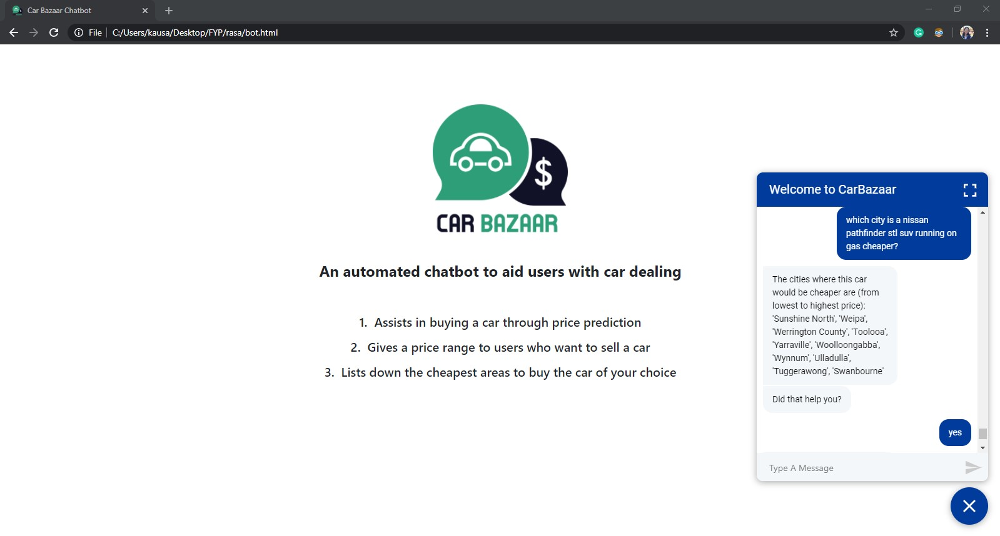
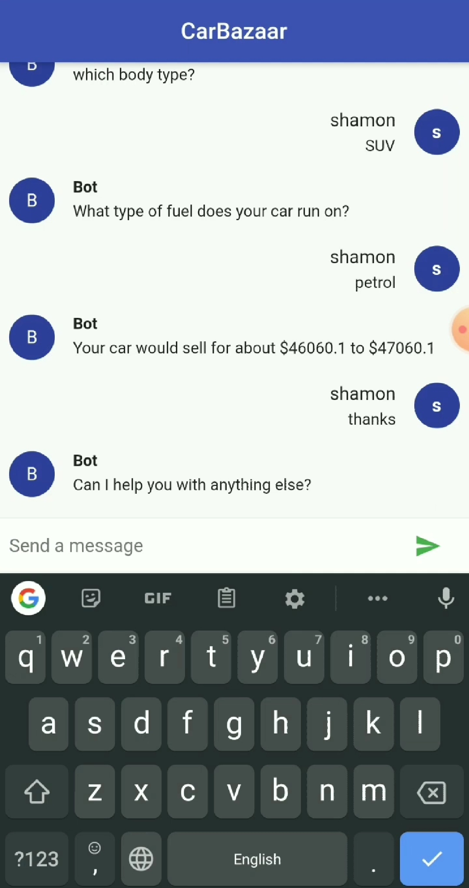

# CarBazaar
CarBazaar is a chatbot to assist car buyers and sellers in deciding when, where, and which cars are most profitable. The chatbot has been designed with the help of Rasa. The project is accessible as a web and mobile application.

# Modules of The Project
## Data Cleaning
In the first module, the task was to analyze the 4 million rows of data and to clean specific columns with intense care that were paramount to training an adequate model. The columns that were given the greatest attention were 'location' and 'badge'.

## Price Prediction Model Training
It took a lot of experimenting to come up with a model that gave stable and accurate results over the entire test data. Linear regression, neural networks, and standard decision trees were tried but did not give comprehensive results. After a series of trial and errors, the random forest regressor was deemed the most suitable.

## Chatbot Module
With the model trained, the next step was to develop a chatbot that understood natural language and was able to initiate human-like conversation that was engaging as well as informative for the person using the chatbot. To achieve both of our goals, we utilized the Rasa module available in Python.

## Web Application
The web application is integrated with the Rasa chatbot through its REST API and its front-end is designed with the help of JavaScript, HTML, and CSS.

## Mobile Application
The mobile application is integrated with the chatbot through socketio and is designed with the help of Flutter.

{:height="50%" width="50%"}
